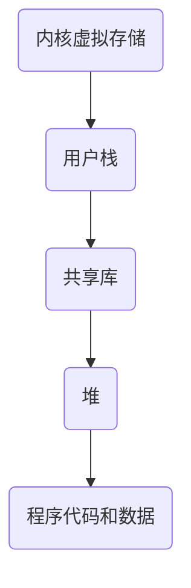

# 1.9 虚拟内存

虚拟内存是一个概念，为每个进程提供了一个假象，即每个进程都在单独地使用主存

每个进程看到的内存都是一致的，称之为<u>虚拟地址空间</u>

## 虚拟地址空间

以下顺序按照从空间底层至空间上层

- 程序代码和数据
  代码从同一固定地址开始，紧接着是和 C 全局变量相互对应的数据位置
- 堆
  代码和数据区紧随着的是运行时堆。<u>代码和数据区在进程一开始运行的时候，就被指定了大小，而堆区在运行的时候，可以进行动态的扩展和收缩</u>
- 共享库
  用于存放像 C 标准库和数学库这样的共享库的代码和数据的区域

- 栈
  位于用户地址空间顶部，编译器用它实现函数调用，和堆一样，用户栈在程序执行期间可以动态地扩展和收缩。有一个很常见的例子，每当我们调用一个函数，栈会增长，从一个函数返回的时候，栈就会收缩
- 内核虚拟内存
  位于地址空间顶部的区域，为内核保留，不允许应用程序读写这部分区域或者直接调用内核定义函数，只能由内核来执行操作
